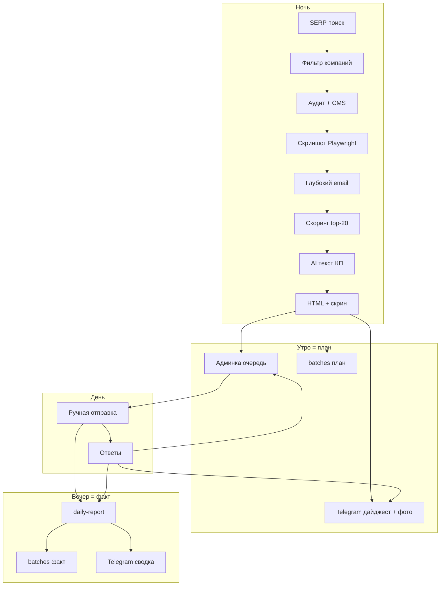

# ТЗ: Лид-радар Auto — утренняя очередь + lead-web.pro + Telegram

**Продукт исходящего контакта:** [lead-web.pro](https://lead-web.pro)  
**Код / админка:** konversus.ru (`/dashboard/secret-shopper`)  
**Дата фиксации:** 2026-09-10  
**Режим:** ночная подготовка → утренний дайджест → **ручная** отправка (~20/день) → ответы в Telegram + админку

---

## Легенда статусов (обновлять после каждого этапа)

| Эмодзи | Статус |
|--------|--------|
| 🟦 | Запланировано |
| 🟨 | В работе |
| 🟩 | Готово |
| 🟥 | Блокер |

**Правило:** статус этапа меняется только когда закрыт **DoD этапа** (чеклист внизу этапа). Подзадачи внутри этапа тоже помечаются этими эмодзи.

---

## Roadmap этапов (сводка)

| # | Этап | Статус |
|---|------|--------|
| 0 | Harness · Loop · Graph + правила разработки | 🟩 |
| 1 | Модель данных и очередь «К отправке» | 🟩 |
| 2 | SERP + фильтр «только сайты компаний» + платформа | 🟩 |
| 3 | Аудит + глубокий email + скриншот сайта | 🟩 |
| 4 | HTML-письмо lead-web.pro + AI-КП + скрин в письме | 🟩 |
| 5 | Ночной пайплайн + утренний дайджест (план) | 🟩 |
| 6 | Админка: список на отправку (ручной режим) | 🟩 |
| 7 | Telegram: чат + скрины + вечерний daily-report (факт) | 🟩 |
| 8 | Ответы → Telegram + админка | 🟩 |
| 9 | Учёт токенов, batches-дашборд, лимиты, полировка | 🟩 |

---

## Цель продукта (одна фраза)

Каждый день конвейер собирает **до 40 качественных лидов** (сайты компаний), готовит КП lead-web.pro и **автоотправляет** каплями в окне 09–18 МСК (бюджет sent≤40); админка — контроль, пропуск, kill-switch; ответы — в Telegram и админку.

> **Поправка 2026-09-14 (владелец):** автоотправка разрешена; лимит дня **40**; режим «контент-цех». Ручной Send/Skip сохранены.

---

## Нецель (жёсткие границы; часть снята 2026-09-14)

- ~~Автоотправка писем без кнопки человека.~~ → **снято**, есть kill-switch в «Рулетка».
- ~~Более 20 исходящих писем в день.~~ → лимит **40** (настраивается).
- Полноценная юрэкспертиза 152-ФЗ (только эвристики по HTML).
- Отдельный SaaS / InstantCMS-ядро / замена Next.js.
- CRM Bitrix/Amo (позже, этап после 9).
- Статьи, гайды, рейтинги, маркетплейсы, агрегаторы, форумы, соцсети как «лид».
- Email только с главной (поверхностный поиск запрещён как достаточный).

---

## Продуктовые правила

1. **Бренд в письме:** lead-web.pro (не Konversus в подписи клиенту).
2. **Лимит:** `daily_send_limit = 20` (настраиваемо).
3. **AI только для финальной пачки** (после скоринга), не для всего сырого SERP.
4. **Только сайты компаний / исполнителей.** Не брать: статьи «как сделать ремонт», блоги СМИ, каталоги (Zoon, Yell, Avito как карточка), Wikipedia, YouTube, соцсети. Фильтр — до аудита и до очереди.
5. **Email — глубокий поиск.** Сначала главная; если нет — обойти страницы контактов и внутренние (см. этап 3). Без email → `skipped_no_email`, не в пачку отправки.
6. **Скриншот сайта обязателен для очереди** (above-the-fold, desktop). Показывать в HTML-КП, в админке и в Telegram. Без скрина лид не в `queued` (или статус `skipped_no_screenshot` + лог).
7. **Human-in-the-loop:** статус `queued` → человек → `contacted` или `skipped`.
8. **Один Telegram-чат** на двоих: дайджест (+ превью скринов) + факт отправки + ответы + **вечерний отчёт**.
9. **Утро = план, вечер = факт.** Утром — пачка к отправке; вечером (~21:00) — сводка: отправлено / открыли / ответили / bounce / токены. Без дежурства у монитора.
10. **География:** один активный город на утро из пула v1; без запросов «вся Россия» в SERP. Кейсы на lead-web.pro — общероссийские, в письме можно опираться на них + локальный город пачки.

> **Почему скрин важен:** получатель сразу видит «это про наш сайт» — лимит доверия растёт в разы. То же для вас с напарником при разборе пачки.

---

## География v1 (зафиксировано 2026-09-10)

### Контекст владельца

| Вопрос | Ответ |
|--------|--------|
| Где уже закрывают | СПб, Омск, Москва, Великий Новгород |
| Выезд | Да: Омск, Великий Новгород; иначе удалённо |
| Кейсы | [lead-web.pro](https://lead-web.pro) — вся Россия |

### Стратегия

1. **Недели 1–2:** фокус **Санкт-Петербург** (+ при нехватке выдачи — Ленобласть как отдельный `city`, не смешивать в один запрос).  
2. **Далее:** ротация пула v1 — **один город на утро**.  
3. Не бить один город каждый день: `cooldown_days` (по умолчанию **3**).  
4. Москва — в пуле, но не каждый день (дорогая конкуренция в выдаче).  
5. Запросов вида «строительная компания Россия» / без города — **нет**.

### Пул городов v1 (priority)

| # | Город | Приоритет | Заметка |
|---|--------|-----------|---------|
| 1 | Санкт-Петербург | home | Старт; основной объём первых 2 недель |
| 2 | Москва | high | Реже в ротации; объём большой |
| 3 | Омск | high | Выезд возможен; сильный локальный акцент в КП |
| 4 | Великий Новгород | high | Выезд возможен; в запросах — «Великий Новгород», не путать с Нижним |

Расширение (tier 2, **не в MVP**): Казань, Екатеринбург, Новосибирск, Краснодар, Нижний Новгород — только после стабильных ответов по v1.

### Ниши × город (ячейка дня)

Каждое утро = **1 ячейка**: `{ city, niche }`.

Ниши v1:

- ремонт квартир / офисов  
- строительная компания  
- производство / поставка стройматериалов  
- инженерные сети / отопление / электрика (по мере набора)

Утренний дайджест Telegram обязательно содержит город и нишу:

`Пачка DD.MM · Омск · ремонт квартир · N готово`

### Конфиг (целевой JSON / settings)

```json
{
  "geo": {
    "strategy": "home_then_rotate",
    "cooldown_days": 3,
    "one_city_per_morning": true,
    "cities": [
      { "id": "spb", "name": "Санкт-Петербург", "priority": "home", "travel": false },
      { "id": "msk", "name": "Москва", "priority": "high", "travel": false },
      { "id": "omsk", "name": "Омск", "priority": "high", "travel": true },
      { "id": "vnovgorod", "name": "Великий Новгород", "priority": "high", "travel": true }
    ],
    "bootstrap_days": 14,
    "bootstrap_city_id": "spb"
  }
}
```

В КП: если `travel=true` для города пачки — можно одной фразой про готовность к выезду/встрече; иначе — акцент на удалённую работу + кейсы по РФ с lead-web.pro.

---

## Архитектура (целевая)

```text
[Cron / n8n 06:00]
    → POST /api/lead-radar/nightly-run
        → SERP → фильтр «только компания» → дедуп
        → audit → screenshot (Playwright)
        → deep contacts (главная → /contacts → внутренние)
        → score → top N (email + screenshot обязательны)
        → AI KP → HTML draft (+ встроенный скрин) → status=queued
        → upsert lead_radar_batches (план: queued_count, tokens)
    → Telegram: утренний дайджест (+ фото скринов)  ← ПЛАН

[Админка /dashboard/secret-shopper]
    → список queued → превью (скрин + письмо) → Send / Skip
    → Send: SMTP (HTML со скрином) → contacted → Telegram «отправлено» + фото

[Ответ: IMAP или форма lead-web.pro?lead=]
    → status=replied → Telegram #ответ → админка

[Cron / n8n ~21:00]
    → POST /api/lead-radar/daily-report
        → агрегат за batch_date: sent / skipped / opened / replied / bounce / tokens
        → UPDATE lead_radar_batches (факт)
        → Telegram: вечерняя сводка  ← ФАКТ
    → если sent=0 за день — отчёт не слать (тихо)
```

**Ядро логики** — Next.js API + MySQL.  
**Скриншоты** — Playwright (уже в стеке) → файл на диске / CDN + URL в БД.  
**n8n** — cron/клей: nightly-run + daily-report (или PM2 cron).  
**Harness** — проверка после каждого инкремента.



---

# Этап 0 — Harness · Loop · Graph + правила разработки

**Статус этапа:** 🟩

Переносим профессиональный каркас с nordic-builder / ProektMap в konversus, адаптируя под Next.js + Лид-радар.

### Зачем

Плоский чат не масштабируется. Нужны:

| Слой | Роль |
|------|------|
| **Harness** | Что читать, что нельзя, какие команды — **до** правки кода |
| **Loop** | Один инкремент: путь → правка → проверка → journal |
| **Graph** | Машиночитаемая карта сущностей и `taskPaths` |

### Артефакты этапа

| # | Артефакт | Статус |
|---|-----------|--------|
| 0.1 | `AGENTS.md` — вход агента, can/cannot, ссылки | 🟩 |
| 0.2 | `.cursor/rules/lead-radar-auto.mdc` — правило для работ по радару | 🟩 |
| 0.3 | `docs/guides/HARNESS.md`, `LOOP.md`, `GRAPH.md` | 🟩 |
| 0.4 | `graph/system.graph.json` — seed карта (lead-radar + ядро) | 🟩 |
| 0.5 | `scripts/harness-check.mjs` + npm `harness:check` | 🟩 |
| 0.6 | `scripts/agent-loop.mjs` + npm `agent:loop` | 🟩 |
| 0.7 | `docs/CURRENT_CONTEXT.md` + `docs/devlog/YYYY-MM.md` | 🟩 |
| 0.8 | Запись в `docs/DOCUMENTATION-INDEX.md` | 🟩 |

### Политика Self-rewrite

| Можно без отдельного permission | Только с «разрешаю self-rewrite» |
|--------------------------------|----------------------------------|
| Код фич этапа, SQL-миграции, UI | `AGENTS.md`, `.cursor/rules/*` |
| `docs/devlog`, `CURRENT_CONTEXT` | Смена schema/типов Graph |
| Обновление статусов 🟦🟨🟩 в этом ТЗ | Правка scripts harness/loop |

### Команды (целевые)

```bash
npm run harness:check           # graph валиден + пути существуют + lint/build smoke (по политике)
npm run agent:loop -- --task lead_radar_queue
```

### taskPaths (seed, этап 0)

| Ключ | Назначение |
|------|------------|
| `lead_radar_queue` | Очередь + статусы |
| `lead_radar_serp` | SERP + фильтр компаний |
| `lead_radar_audit` | Аудит / cookie / deep email / screenshot |
| `lead_radar_email` | HTML + send (+ скрин в письме) |
| `lead_radar_telegram` | Telegram (+ фото скрина) |
| `lead_radar_daily_report` | Вечерний daily-report → TG + batches |
| `lead_radar_replies` | Ответы |
| `prod_restart` | build + pm2 |

### DoD этапа 0

- [x] Graph JSON валиден, `harness:check` зелёный
- [x] Guides на русском, как в nordic-builder
- [x] Агент в новой сессии читает AGENTS → CURRENT_CONTEXT → Graph
- [x] Статус этапа → 🟩

---

# Этап 1 — Модель данных и очередь «К отправке»

**Статус этапа:** 🟩  
**Зависит от:** 0 (желательно), можно параллелить схему БД

### Изменения БД (`sql/00x_lead_radar_auto.sql`)

Расширить `lead_radar_sites` (или связанную таблицу):

| Поле | Тип | Смысл |
|------|-----|--------|
| `platform` / `cms` | VARCHAR | Платформа сайта (Tilda, Bitrix, …) |
| `source` | ENUM | `serp` / `maps` / `manual` |
| `serp_query` | VARCHAR | Запрос |
| `serp_position` | INT | Позиция |
| `privacy_issues` | JSON | Замечания cookie/политики |
| `screenshot_path` | VARCHAR | Путь к файлу скрина на диске |
| `screenshot_url` | VARCHAR | Публичный URL скрина (для письма/TG) |
| `screenshot_at` | DATETIME | Когда снят |
| `email_source_url` | VARCHAR | Страница, где найден email |
| `kp_html` | MEDIUMTEXT | Черновик письма |
| `kp_subject` | VARCHAR | Тема |
| `kp_tokens_in` | INT | Токены input |
| `kp_tokens_out` | INT | Токены output |
| `hot_score` | INT | Горячесть |
| `queued_at` | DATETIME | Когда попал в утреннюю пачку |
| `batch_date` | DATE | Дата пачки (для лимита 20/день) |
| `reject_reason` | VARCHAR | Почему отброшен (article/aggregator/no_email/…) |

Статусы: добавить минимум  
`queued` | `skipped` | `skipped_no_email` | `skipped_no_screenshot` | `rejected_not_company` | `bounced`  
к существующим `new/contacted/replied/won/lost/archived`.

Таблица `lead_radar_batches` (**обязательна** для плана/факта дня):

| Поле | Смысл |
|------|--------|
| `batch_date` | Дата пачки |
| `queued_count` | План утром |
| `sent_count` | Отправлено |
| `skipped_count` | Пропущено вручную |
| `opened_count` | Уникальные открытия |
| `replied_count` | Ответы / заявки |
| `bounce_count` | Bounce / failed |
| `tokens_total` | Сумма токенов AI за пачку |
| `report_sent_at` | Когда ушёл вечерний отчёт в TG |

Утро пишет план (`queued_count`, `tokens_total`); вечерний `daily-report` дописывает факт.
Хранилище скринов: например `public/uploads/lead-screenshots/{siteId}.jpg` или вне webroot + раздача через API/статику. Не коммитить бинарники в git.

### API

- `action: "list-queue"` — сайты `queued` за сегодня (со `screenshot_url`)
- `action: "skip-site"` / уже есть update-status
- Лимит: не больше 20 со статусом `queued` на `batch_date = TODAY` (конфиг)

### DoD этапа 1

- [x] Миграция накатана на MySQL (`sql/005_lead_radar_auto.sql`)
- [x] Data-layer читает/пишет новые поля, в т.ч. screenshot_* и email_source_url
- [x] Дедуп по `domain` сохраняется (insert skip on error)
- [x] API: `list-queue`, `queue-site`, `skip-site` + лимит 20
- [x] `harness:check` + статус → 🟩

---

# Этап 2 — SERP + фильтр «только сайты компаний» + платформа

**Статус этапа:** 🟩  
**Зависит от:** 1

### Требование

Поиск компаний в **органической выдаче** (Яндекс и/или Google), **не** через карты как основной канал.  
Maps/2GIS оставить как `source=maps` (вторичный), не удалять сразу.

### Жёсткий фильтр: не статьи, только компании

В пачку и в аудит **не** попадают:

| Отбрасывать | Примеры / эвристики |
|-------------|---------------------|
| Статьи и гайды | URL `/blog/`, `/article/`, `/news/`, title «как …», «ТОП-10», «обзор» |
| СМИ / энциклопедии | rbc, vc.ru, wikipedia, dzen.ru (лента) |
| Агрегаторы и каталоги | zoon, yell, 2gis.ru/карточка, avito, youdo, profi.ru |
| Соцсети / видео | vk.com, t.me, youtube, rutube |
| Маркетплейсы | wildberries, ozon (карточки) |

Правила фильтра (комбо):

1. **Blacklist доменов** (конфиг).  
2. **URL/title heuristics** (статья vs компания).  
3. **Сигналы компании:** телефон, ИНН/ООО в футере, «услуги», прайс, форма заявки, CMS-конструктор лендинга.  
4. Сомнение → `rejected_not_company` + `reject_reason`, **не** в очередь.

Качество важнее полноты SERP: лучше 15 чистых компаний, чем 20 с мусором.

### Реализация SERP (решение 2026-09-10)

| Вариант | Статус |
|---------|--------|
| **A. Serper.dev** | ✅ выбран (`SERPER_API_KEY`, `gl=ru`, `hl=ru`) |
| B. Playwright по выдаче | ❌ не MVP (хрупко, капчи, хуже для новичка) |

Playwright оставляем только для **скриншотов** сайта (этап 3), не для поиска.

### Выход записи

`name`, `url`, `domain`, `platform` (из audit или быстрый sniff), `source=serp`, `serp_query`, `serp_position`.

Ниши и города — см. **География v1**. Запросы только вида  
`«{ниша} {город}»` / `«{ниша} в {городе}»`, под **исполнителей**, не под статьи.  
Планировщик nightly выбирает ячейку дня из пула + cooldown.
### DoD этапа 2

- [x] API `search-serp` возвращает список без карт (Serper, `gl/hl=ru`)
- [x] Статьи/агрегаторы отсекаются (`company-site-filter`)
- [ ] Платформа пишется в карточку лида — на этапе 3 (audit/CMS)
- [x] Дедуп не плодит дубли доменов
- [x] Статус → 🟩 (платформа перенесена в DoD этапа 3)

---

# Этап 3 — Аудит + глубокий email + скриншот сайта

**Статус этапа:** 🟩  
**Зависит от:** 1–2

### 3A. Аудит (`website-checker.ts`)

Уже есть: HTTPS, H1, viewport, copyright, speed, phone, **CMS**.

Добавить эвристики (не юрзаключение):

| Проверка | Сигнал |
|----------|--------|
| Страница политики | `/privacy`, `/politika`, «политика конфиденциальности» |
| Cookie-баннер / согласие | типичные селекторы/тексты |
| Скрипты аналитики без явного согласия | Метрика/GA в HTML (флаг риска) |
| Базовый SEO | title, description, один H1 |

`platform` = `cms` из сигнатур (обязательно в UI и в КП).

### 3B. Глубокий поиск email (обязательно)

Порядок обхода (стоп при первом валидном рабочем email, не noreply/не CDN):

1. Главная страница.  
2. Типовые URL: `/contacts`, `/contact`, `/kontakty`, `/o-nas`, `/about`, `/company`, `/rekvizity`.  
3. Ссылки из меню/футера с текстом «Контакт», «Связь», «Написать».  
4. До **N внутренних** страниц того же домена (лимит 5–8, таймаут, без ухода на внешние).

Правила:

- Игнорировать: `noreply@`, `info@tilda`, почты хостингов/конструкторов по blacklist.  
- Предпочитать корпоративный домен (= домен сайта).  
- Сохранять `email` + `email_source_url`.  
- Mailto и plaintext regex; при необходимости текст из `tel:`/схем не путать с email.

Без email после обхода → `skipped_no_email`.

### 3C. Скриншот сайта (обязательно для очереди)

| Параметр | Значение |
|----------|----------|
| Инструмент | Playwright Chromium (уже в проекте) |
| Viewport | Desktop ~1280×720…800, above-the-fold |
| Формат | JPEG/WebP, сжатие для письма (< ~300–500 KB) |
| Когда | После того как URL открылся (тот же визит, что аудит, или сразу после) |
| Хранение | `screenshot_path` + публичный `screenshot_url` |
| Fail | `skipped_no_screenshot` — в `queued` не попадает |

Скрин — **тот же визуал**, что в письме и в Telegram (один файл, не два разных кадра).

Скоринг: hotScore; в очередь только порог **+ email + screenshot + not rejected**.

### DoD этапа 3

- [x] Проблемы в `problems` + `privacy_issues` (website-checker)
- [x] Платформа (= cms) в ответе enrich-site / audit (`platform`)
- [x] Глубокий email: `deep-email.ts` (главная → contacts → внутренние)
- [x] Скриншот Playwright → `/uploads/lead-screenshots/…`
- [x] Без email / без скрина → `statusHint` skipped_*
- [x] API `POST /api/secret-shopper/enrich-site`
- [x] Статус → 🟩

---

# Этап 4 — HTML-письмо lead-web.pro + AI-КП + скрин в письме

**Статус этапа:** 🟩  
**Зависит от:** 3

### Письмо

- Красивый **HTML** (инлайн-стили, мобильный), тон бренда lead-web.pro.
- **Блок со скриншотом сайта получателя** сразу под приветствием / «посмотрел ваш сайт» — абсолютный URL картинки (многие клиенты режут cid-вложения).
- Подпись под фото: «Фрагмент главной страницы {domain} на момент проверки».
- Не перегружать: бренд, скрин, 1–2 проблемы, 1 мысль по развитию/автоматизации, CTA.
- CTA → `https://lead-web.pro/?utm_source=radar&utm_medium=email&utm_campaign=batch_{date}&lead={id}`
- Подпись команды lead-web.pro + контакты с сайта.
- Трекинг-пиксель (уже есть) сохранить.
- Указывать **платформу** сайта одной строкой.

### AI (`ai-composer.ts`)

- Промпт: бренд **lead-web.pro**, не Konversus.
- Вход: audit + platform + niche + city (скрин в текст не «описывать» — он в HTML).
- Выход: `{ subject, bodyText }` → шаблон оборачивает в HTML + ``.
- Логировать `kp_tokens_in` / `kp_tokens_out`.
- AI вызывать **только** для отобранных ≤20.

### Оценка бюджета токенов (ориентир)

| | На 1 КП | На 20/день | Мес. (~22 дня) |
|--|---------|------------|----------------|
| Tokens | ~2.5–3.5k | ~50–70k | ~1.1–1.5M |
| DeepSeek | ~$0.02–0.05/день | | ~$0.5–1.5 |

### DoD этапа 4

- [x] Превью HTML в админке (KpModal iframe после AI-КП)
- [ ] Тестовое письмо на свой ящик: картинка сайта видна — проверить вручную после деплоя
- [x] Ссылка CTA → lead-web.pro с utm + leadId
- [x] Токены пишутся в БД при `save: true`
- [x] From/подпись lead-web.pro (не Konversus)
- [x] Статус → 🟩

---

# Этап 5 — Ночной пайплайн + утренний дайджест (план)

**Статус этапа:** 🟩  
**Зависит от:** 2–4

### Поведение

1. Cron ~06:00 МСК (PM2 cron **или** n8n → webhook).
2. Для активных радаров / конфиг-городов: SERP → фильтр компаний → audit → screenshot → deep email → score.
3. Взять top до 20 с **email + screenshot**, ещё не contacted за X дней.
4. Сгенерировать КП (HTML со скрином) → `status=queued`, `batch_date=today`.
5. **Upsert `lead_radar_batches`:** план дня (`queued_count`, `tokens_total`).
6. Telegram: краткий дайджест + **фото скринов** (пачкой или первые N) + ссылка в админку ← **утро = план**.

Идемпотентность: повторный cron в тот же день не плодит вторую пачку сверх лимита.

### DoD этапа 5

- [x] Один успешный nightly-run на проде (limit=1 → `prorabneva.ru` queued)
- [x] У лида есть screenshot_url + email; лимит 20 в коде
- [x] `lead_radar_batches.queued_count` обновляется
- [x] Telegram-дайджест (текст; фото — этап 7) — `telegram.ok`
- [x] Cron-скрипт `scripts/cron-lead-radar-nightly.sh` + `LEAD_RADAR_CRON_SECRET`
- [x] Статус → 🟩

---

# Этап 6 — Админка: список на отправку (ручной режим)

**Статус этапа:** 🟩  
**Зависит от:** 1, 4

### UI (вкладка / секция «Сегодня»)

Для каждого лида:

- **Миниатюра скриншота** (крупно, не иконка 40px)
- Название, город, ниша, **платформа**, hotScore  
- Email (+ страница-источник `email_source_url`)  
- Краткий список проблем  
- Превью письма  
- Кнопки: **Отправить** | **Пропустить** | Открыть сайт  

После «Отправить»: SMTP (HTML со скрином), `contacted`, лог в `lead_emails`, Telegram «отправлено» + фото.

Не требует целый день у монитора: достаточно утренней сессии 20–40 мин вдвоём.

### DoD этапа 6

- [x] Можно закрыть пачку дня без CLI
- [x] Скрин виден до отправки
- [x] Skip не отправляет письмо
- [x] Статус → 🟩

---

# Этап 7 — Telegram: чат + скрины + вечерний daily-report (факт)

**Статус этапа:** 🟩  
**Зависит от:** 5–6

### Один групповой чат + один бот

| Событие | Сообщение |
|---------|-----------|
| Утро (= план) | «Пачка DD.MM: N готово» + ссылка; **sendPhoto** по лидам (или альбом) |
| Отправка | «✅ Отправлено: {name} · {platform} · {email}» + **то же фото скрина** |
| Пропуск | опционально кратко |
| Ответ / интерес | «🔥 Ответ/заявка: {name}» (+ скрин если есть) |
| Вечер (~21:00) (= факт) | Сводка `daily-report` (см. ниже) |

Кнопки (желательно): «Открыть в админке».

Настройки: `telegram_bot_token`, `telegram_chat_id` (уже есть в settings — проверить группу).

База: расширить `src/lib/lead-hunter/telegram.ts` — `sendMessage` + `sendPhoto` (file URL или multipart).

Лимит Telegram: не спамить 20 полными альбомами без нужды — утром можно 1 сводку + фото по запросу / первые 5 «горячих», а при **отправке** фото обязательно. Открытия писем днём в чат **не** пушить — только в вечерней сводке.

### Вечерний отчёт (`POST /api/lead-radar/daily-report`)

Cron / n8n ~21:00 МСК:

1. Собрать метрики за `batch_date = TODAY` (или «сегодня по МСК»).  
2. Обновить `lead_radar_batches` (факт).  
3. Отправить в Telegram **одно** сообщение:

```text
📊 День DD.MM
Пачка: {queued} → отправлено {sent} · пропуск {skipped}
Открыли: {opened} ({open_rate}%)
Ответы/заявки: {replied}
Bounce: {bounce}
Токены AI: ~{tokens} (~${usd})
```

Правила:

- Если `sent_count = 0` — **не слать** отчёт (тихо).  
- Open-rate — ориентир (пиксель неточен), смотреть трендом.  
- Главный акцент в тексте — **ответы**, не открытия.  
- Идемпотентность: повторный cron не дублирует сообщение, если `report_sent_at` уже стоит (или шлёт «обновление» только по флагу).

Разделение ответственности с этапом 9: **этап 7 = доставка отчёта в Telegram + запись факта в batches**; этап 9 = дашборд/история/токены в админке и полировка цифр.

### DoD этапа 7

- [x] Оба видят дайджест и отправки
- [x] При отправке в чат уходит скрин сайта клиента
- [x] `daily-report` пишет batches и шлёт вечернюю сводку
- [x] При 0 отправок отчёт не уходит
- [x] Нет спама на каждое открытие письма
- [x] Статус → 🟩

---

# Этап 8 — Ответы → Telegram + админка

**Статус этапа:** 🟩  
**Зависит от:** 6–7

### Каналы интереса (оба в MVP-плане; можно по очереди)

1. **Форма / CTA на lead-web.pro** с `lead=` → webhook → `replied` + Telegram.  
2. **Ответ на email** (IMAP/n8n) → match по Message-ID / leadId в теме/`Reply-To` → `replied` + Telegram.  
3. Ручная кнопка в админке «Отметить ответ» — запасной путь.

В админке фильтр «Ответили» + те же статусы, что в Telegram.  
`replied_count` в batches должен совпадать с тем, что видит вечерний отчёт.

**Реализация v1:**
- CTA в письме → `/api/lead-radar/interest?lead=` (авто-канал) → TG + редирект на lead-web.pro
- Webhook: `POST /api/lead-radar/reply-webhook` (Bearer `LEAD_RADAR_CRON_SECRET` / `LEAD_RADAR_WEBHOOK_SECRET`)
- Админка: фильтр «Ответили» + кнопка «🔥 Ответ»
- IMAP — позже (этап можно добить без блокировки MVP)

### DoD этапа 8

- [x] Хотя бы один авто-канал ответов работает end-to-end
- [x] Статус в БД и сообщение в чат совпадают
- [x] Статус → 🟩

---

# Этап 9 — Учёт токенов, batches-дашборд, лимиты, полировка

**Статус этапа:** 🟩  
**Зависит от:** 4–8

Закрывает контур **утро = план / вечер = факт** в админке (Telegram-доставка уже в этапе 7).

- Экран/блок «Статистика дней»: данные из `lead_radar_batches` (queued → sent → opened → replied → bounce, токены).  
- Сверка: цифры вечернего TG = цифры в админке за тот же `batch_date`.  
- Конфиг: `daily_send_limit`, порог hotScore, города, ниши, время `daily_report` (по умолчанию 21:00 МСК).  
- Blacklist доменов (агрегаторы).  
- A/B темы — только если база писем стабильна.

**Реализация v1:**
- Вкладка **Статистика** в `/dashboard/secret-shopper`
- API `list-batches` + live `collectDayFacts` (тот же расчёт, что вечерний TG)
- Лимит 20 в `src/lib/lead-radar/config.ts` → nightly + queue API
- Blacklist — `company-site-filter.ts` (уже в пайплайне)

### DoD этапа 9

- [x] Видна сумма токенов за день и история batches
- [x] Лимит 20 соблюдается кодом, не «на честном слове»
- [x] Админка и вечерний TG показывают одни и те же метрики дня
- [x] Статус → 🟩 → MVP Auto закрыт

---

## Порядок работ агента (каждый инкремент)

По правилам Harness · Loop · Graph:

```text
1. Load   → AGENTS.md + CURRENT_CONTEXT + этот ТЗ (статусы)
2. Path   → graph.taskPaths[<task>]
3. Edit   → только узлы пути; без «заодно»
4. Check  → npm run harness:check  (ERROR = стоп)
5. Sync   → обновить Graph / статусы этапа 🟦→🟨→🟩
6. Journal→ docs/devlog/YYYY-MM.md
7. Commit → только если владелец попросил
```

---

## Критерии готовности всего MVP (после этапа 9)

| Критерий | Проверка |
|----------|----------|
| Утром есть очередь ≤40 | БД `queued` + Telegram (план) |
| Вечером сводка в TG | sent / opened / replied / bounce (факт) |
| batches хранит план и факт | `lead_radar_batches` за день |
| В очереди только сайты компаний | Нет статей/агрегаторов в выборке |
| Email найден глубоко | Фикстура «почта только в /contacts» |
| Письмо красивое + CTA + **скрин сайта** | Ручной тест на свой ящик |
| Платформа сайта в карточке и в письме | UI |
| Скрин в Telegram при отправке | Чат с напарником |
| Автоотправка ≤40/день каплями | cron `auto-send` + kill-switch |
| Напарник видит отправки и ответы | Группа Telegram |
| Ответы в админке | status=`replied` |
| Токены учтены | сумма за день |

---

## Риски и решения

| Риск | Решение |
|------|---------|
| SERP-блок / капча | Платный SERP API |
| Статьи просачиваются в пачку | Blacklist + эвристики + ручной Skip; улучшать фильтр по логам `reject_reason` |
| Спам-фильтры | Отдельный outreach-домен, прогрев, 20/день |
| Нет email на главной | Глубокий обход контактов/внутренних (этап 3B) |
| Нет email на сайте | `skipped_no_email`, не ломать пачку |
| Клиент режет картинки в письме | Публичный HTTPS URL скрина; дублировать факт «посмотрел сайт» текстом |
| Тяжёлые скрины / диск | JPEG сжатие, ротация файлов старше N дней |
| Playwright тормозит nightly | Параллель ограничить (2–3), таймауты, скрин только кандидатам после грубого фильтра |
| Юр. претензии к формулировкам | Мягкий тон «риски», без угроз |
| Расползание scope | Этапы 0→9 строго; CRM — после MVP |

---

## Связанные документы

- [LEAD-RADAR.md](./LEAD-RADAR.md) — текущая реализация  
- [SECRET-SHOPPER.md](./SECRET-SHOPPER.md) — UI/сценарии  
- После этапа 0: `docs/guides/HARNESS.md`, `LOOP.md`, `GRAPH.md`, `graph/system.graph.json`

---

## Журнал смены статусов

| Дата | Что | Было → Стало |
|------|-----|--------------|
| 2026-09-10 | ТЗ зафиксировано, все этапы | — → 🟦 |
| 2026-09-10 | Дополнение: только компании; глубокий email; скриншот в КП и Telegram | этапы 2–7 уточнены, правила 4–6 |
| 2026-09-10 | Утро = план / вечер = факт: daily-report в этапе 7, batches-дашборд в этапе 9 | правило 9, арх., этапы 5/7/9 |
| 2026-09-10 | Этап 0 закрыт (Harness/Loop/Graph) | 🟨 → 🟩 |
| 2026-09-10 | Этап 1 стартовал | 🟦 → 🟨 |
| 2026-09-10 | Этап 1 закрыт (БД + queue API) | 🟨 → 🟩 |
| 2026-09-10 | SERP: Serper.dev выбран вместо Playwright для поиска | этап 2 🟨 |
| 2026-09-10 | География v1: СПб → ротация Мск/Омск/В.Новгород; 1 город/утро; кейсы РФ на lead-web.pro | правило 10 + раздел |

*После закрытия этапа: одна строка сюда + эмодзи в таблице Roadmap.*
